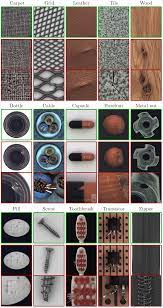
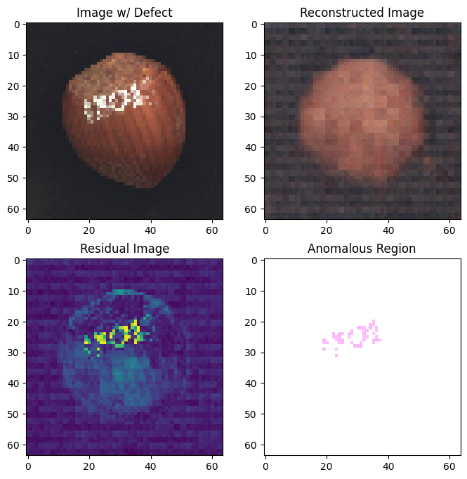

# ANOMALY DETECTION USING TRANSGAN

## Project Overview

This project investigates the efficacy of **TransGAN**, a model that combines the power of vision transformers and Generative Adversarial Networks (GANs), for anomaly detection in image data. It addresses the increasing industry dependency on automated visual inspection systems and the critical need for reliable anomaly detection methods in various domains such as manufacturing, medical imaging, and surveillance. The research explores two primary approaches using TransGAN, demonstrating its capability across different image datasets and highlighting opportunities for further advancements in the field.

## Key Features & Approaches

* **TransGAN Architecture**: Utilizes TransformerEncoder layers instead of traditional convolutional layers to capture spatial dependencies, enhancing image quality and enabling usage across several applications.
* **Latent Space Exploration for MVTecAD**: Trains TransGAN on non-defective images from the MVTecAD dataset and leverages the iterative latent space mapping method of Ano-GAN to detect deviations from learned normal distributions.
    * **Loss Functions**: Employs L1 loss for reconstruction and perceptual difference, and balances these losses to find the optimal latent representation.
    * **Anomaly Identification**: Identifies anomalous regions by computing a "residual image" (difference between input and reconstructed image).
* **Imbalanced Dataset Anomaly Detection for CIFAR-10**: Integrates TransGAN with a pre-trained ResNet50 model for feature extraction and employs two discriminators (one for normal data, one for anomalous data) to effectively address data imbalance.
    * **Loss Functions**: Uses a weighted combination of six different losses for the generator and one for each discriminator, including L1 loss, patch loss, latent vector loss, adversarial losses, and ABC loss.
* **Addressing Challenges**: Aims to bridge gaps in existing solutions by focusing on unsupervised approaches to reduce dependency on labeled data, improve generalization across diverse usage, balance computational cost with detection efficiency, and enhance model interpretability.

## Datasets Used

* **MVTecAD**: A benchmark dataset for anomaly detection containing 5000 images across fifteen different objects (e.g., 'hazelnut', 'metal nut', 'bottle') with flawless training pictures and a test set including various defects.
    * *Image Placeholder: MVTecAD Dataset Sample*
        
* **CIFAR-10**: Comprises 32x32 pixel color images from 10 classes of objects (e.g., airplane, automobile, bird, cat). One class is selected as anomaly and others as normal data for training.
    * *Image Placeholder: CIFAR-10 Sample Dataset*
        

## Training Details

Experiments were conducted on GPU T4x2 with 15GB Memory using the PyTorch framework on Google Colab and Kaggle platforms.

* **Optimizers**: Adam optimizers with momentum b1=0.001 and beta2=0.99.
* **Learning Rate**: 0.0001 for both generator and discriminator.
* **MVTec-AD Hyperparameters**:
    * Image Size: 64
    * Epochs: 350
    * Batch Size: 8
    * Latent Dimension: 1024
    * Number of Iterations: 1000

## Results

### Anomaly Detection in MVTec-AD

* Generated images for the 'hazelnut' class show transformation from noise to more realistic images as epochs increase, though not yet production-grade.
    * *Image Placeholder: Generated Images of Hazelnut Dataset*
        

* Anomaly reconstruction on test images with defects shows poor reconstruction, and anomalous regions are identified by comparing the input and reconstructed images.
    * *Image Placeholder: Anomaly Reconstruction and Highlighting of Hazelnut*
        

## Future Work

The research highlights several areas for future development:

* **Improved Generalization**: Developing models that can effectively handle diverse data across various domains and settings.
* **Real-time Performance**: Further research to balance computational cost with detection efficiency for real-time applications.
* **Enhanced Interpretability**: Improving model transparency and explanations for anomaly detection decisions, especially in sensitive domains like healthcare and security.
* **Multimodal Data Integration**: Exploring anomaly detection in environments that generate data in different modes (images, video, audio, sensor, etc.).
* **Scalability and Efficiency**: Researching methods that can process large-scale data without compromising efficiency and accuracy.
* **Data Privacy and Security**: Developing methods to ensure data security and privacy, especially when dealing with sensitive information.
